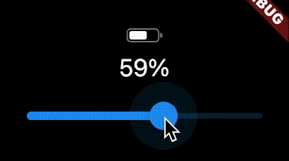

This package provides a single widget: `BatteryIndicator`.
It resembles the battery icon used in the macOS menu bar, but is very customizable.
You can provide any value it should display.



## Features

* Looks like a stylized battery laying on its side
* Shows any percentage given to it
* Optionally show the percentage as text next to the icon
* Customizable colors and sizes

## Getting started

Just include the `BatteryIndicator` library:

```dart
import 'package:cupertino_battery_indicator/cupertino_battery_indicator.dart';
```

## Usage

TODO: Include short and useful examples for package users. Add longer examples
to `/example` folder.

```dart
Widget buildIndicator(value) =>
  Row(
    mainAxisSize: MainAxisSize.min,
    children: [
      Padding(
        padding: const EdgeInsets.only(right: 16.0),
        child: BatteryIndicator(value: value),
      ),
      Text('${(value * 100).ceil()}%'),
    ],
  );
```

## Additional information

Feel free to open issues with suggestions or feature requests.

PRs are welcome!

## License

Licensed under the MIT license. Read more [here](./LICENSE).
